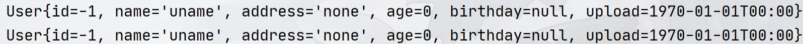

## Spring Framework

> 官方Overview：https://docs.spring.io/spring-framework/reference/overview.html

`Spring`框架

// 参考黑马和官方文档编写此处内容


### Spring IoC快速入门

到此，您已基本了解`Spring`框架诞生的意义，接下来我们正式开始上手`Spring`框架。

我们首先上手`Spring IoC`，上手`IoC`容器的步骤可以参考如下：

1. 创建`Maven`项目，导入`Spring IoC`相关的包
2. 创建我们的`JavaBean`类
3. 编写配置文件来指定`IoC`容器内需要创建那些`Java`对象
4. 实例化`IoC`容器获取`Java`对象

创建`Maven`项目，导入下面`Spring`相关的包（`Spring`框架运行至少需要下面的包），这些第三方包你可以在`maven`中央仓库中找到，文章贴出对应的包的用途以及其`maven`地址

- `spring-core.jar`：[spring核心包，包含spring框架的基础类库和工具](https://mvnrepository.com/artifact/org.springframework/spring-core)
- `spring-context.jar`：[spring上下文包，主要定义了和IoC相关的内容，包括IoC容器、DI等](https://mvnrepository.com/artifact/org.springframework/spring-context)
- `spring-jcl.jar`：[spring java commons Logging bridge，用于日志记录](https://mvnrepository.com/artifact/org.springframework/spring-jcl)
- `spring-beans.jar`：[用于实例化、配置和组装Java对象的配置框架和基本功能](https://mvnrepository.com/artifact/org.springframework/spring-beans)
- `spring-expression.jar`：[用于处理SpEL表达式](https://mvnrepository.com/artifact/org.springframework/spring-expression)
- `spring-aop.jar`：[用于提供aop编程支持](https://mvnrepository.com/artifact/org.springframework/spring-aop)

读者可以在导入这些jar包的时候，他们的版本尽量要统一，不然可能会出现很多问题，而且由于`Spring 6`以后需要`JDK 17+`版本，所以如果机器上的`JDK`版本不高，建议使用`Spring 5`或者`Spring 4`，下面是笔者的`maven`配置（笔者使用的是`5.3.13`）：

```xml
<properties>
    <java.version>8</java.version>
    <maven.compiler.source>${java.version}</maven.compiler.source>
    <maven.compiler.target>${java.version}</maven.compiler.target>
    <spring.version>5.3.13</spring.version>
</properties>

<!-- 因为笔者这里使用的是Idea多模块开发，因此顶层的pom使用了dependencyManagement来统一依赖-->
<!-- 如果你不是多模块环境，请复制dependencies以下的内容，去掉dependencyManagement标签 -->
<dependencyManagement>
    <dependencies以下的内容，去掉>
        <!-- spring framework core packages-->
        <dependency>
            <groupId>org.springframework</groupId>
            <artifactId>spring-core</artifactId>
            <version>${spring.version}</version>
        </dependency>
        <dependency>
            <groupId>org.springframework</groupId>
            <artifactId>spring-aop</artifactId>
            <version>${spring.version}</version>
        </dependency>
        <dependency>
            <groupId>org.springframework</groupId>
            <artifactId>spring-context</artifactId>
            <version>${spring.version}</version>
        </dependency>
        <dependency>
            <groupId>org.springframework</groupId>
            <artifactId>spring-jcl</artifactId>
            <version>${spring.version}</version>
        </dependency>
        <dependency>
            <groupId>org.springframework</groupId>
            <artifactId>spring-expression</artifactId>
            <version>${spring.version}</version>
        </dependency>
        <dependency>
            <groupId>org.springframework</groupId>
            <artifactId>spring-beans</artifactId>
            <version>${spring.version}</version>
        </dependency>

        <!-- junit -->
        <dependency>
            <groupId>junit</groupId>
            <artifactId>junit</artifactId>
            <version>4.13.2</version>
            <scope>test</scope>
        </dependency>
    </dependencies>
</dependencyManagement>
```

然后我们简单创建一个类，这个类随意即可，如常见的`JavaBean`，如我们创建一个`User`实体类：

```java
public class User {
    private Integer id;
    private String name;
    private String address;
    private int age;
    private Date birthday;
    private LocalDateTime upload;

    public User() {
        this.id = -1;
        this.name = "uname";
        this.address = "none";
        this.age = 0;
        this.birthday = null;
        this.upload = LocalDateTime.of(1970, 1, 1, 0, 0,0);
    }


    public User(Integer id, String name, String address, int age, Date birthday, LocalDateTime upload) {
        this.id = id;
        this.name = name;
        this.address = address;
        this.age = age;
        this.birthday = birthday;
        this.upload = upload;
    }

    @Override
    public String toString() {
        final StringBuffer sb = new StringBuffer("User{");
        sb.append("id=").append(id);
        sb.append(", name='").append(name).append('\'');
        sb.append(", address='").append(address).append('\'');
        sb.append(", age=").append(age);
        sb.append(", birthday=").append(birthday);
        sb.append(", upload=").append(upload);
        sb.append('}');
        return sb.toString();
    }

    public Integer getId() {
        return id;
    }

    public User setId(Integer id) {
        this.id = id;
        return this;
    }

    public String getName() {
        return name;
    }

    public User setName(String name) {
        this.name = name;
        return this;
    }

    public String getAddress() {
        return address;
    }

    public User setAddress(String address) {
        this.address = address;
        return this;
    }

    public int getAge() {
        return age;
    }

    public User setAge(int age) {
        this.age = age;
        return this;
    }

    public Date getBirthday() {
        return birthday;
    }

    public User setBirthday(Date birthday) {
        this.birthday = birthday;
        return this;
    }

    public LocalDateTime getUpload() {
        return upload;
    }

    public User setUpload(LocalDateTime upload) {
        this.upload = upload;
        return this;
    }
}
```

再来我们创建一个`IoC`容器的`xml`配置，该文件位于`main/resources`目录下：`spring-context.xml`，输入`spring`的`bean`相关的`xsd`

```xml
<?xml version="1.0" encoding="UTF-8"?>
<beans xmlns="http://www.springframework.org/schema/beans"
       xmlns:xsi="http://www.w3.org/2001/XMLSchema-instance"
       xsi:schemaLocation="http://www.springframework.org/schema/beans
       http://www.springframework.org/schema/beans/spring-beans.xsd">

</beans>
```

这里额外补充`spring`容器配置的`xml`全`xsd`（包括p命名、`mvc`、`aop`、`tx`、`context`等），可以将下面的内容做成`idea`的`live template`：

```xml
<beans xmlns="http://www.springframework.org/schema/beans"
       xmlns:xsi="http://www.w3.org/2001/XMLSchema-instance"
       xmlns:p="http://www.springframework.org/schema/p"
       xmlns:context="http://www.springframework.org/schema/context"
       xmlns:aop="http://www.springframework.org/schema/aop"
       xmlns:tx="http://www.springframework.org/schema/tx"
       xmlns:mvc="http://www.springframework.org/schema/mvc"
       xsi:schemaLocation="http://www.springframework.org/schema/beans
         http://www.springframework.org/schema/beans/spring-beans.xsd
         http://www.springframework.org/schema/context
         http://www.springframework.org/schema/context/spring-context.xsd
         http://www.springframework.org/schema/aop
         http://www.springframework.org/schema/aop/spring-aop.xsd
         http://www.springframework.org/schema/tx
         http://www.springframework.org/schema/tx/spring-tx.xsd
         http://www.springframework.org/schema/mvc
         https://www.springframework.org/schema/mvc/spring-mvc.xsd">
     
</beans>
```

在容器`xml`中，使用`bean`标签来指定`IoC`容器内创建哪些对象：

```xml
<bean id="user" class="cn.argento.askia.beans.User"></bean>
<!--
	id:对象在IoC容器内的id名称，在IoC容器内,每个对象都有一个唯一的id名称,这个名称可以方便我们获取对象
	（Spring 3.0之后基本很少使用xml配置的方式来初始化容器了，所以在Spring 3.0以后，id实际上也不是必须的了）
	class:指定是基于哪一个类创建的对象，需要写全限定类名

	使用这种方式创建对象会调用默认构造器（很好理解，毕竟我们没有传递构造器参数）
-->
```

整个配置如下（我们会在依赖注入章节具体介绍`bean`标签的各类属性和子标签）：

```xml
<?xml version="1.0" encoding="UTF-8"?>
<beans xmlns="http://www.springframework.org/schema/beans"
       xmlns:xsi="http://www.w3.org/2001/XMLSchema-instance"
       xsi:schemaLocation="http://www.springframework.org/schema/beans
       http://www.springframework.org/schema/beans/spring-beans.xsd">

    <bean id="user" class="cn.argento.askia.beans.User"></bean>
</beans>
```

最后，我们进行相应的测试来获取对象，我们在`test`新建一个`SpringContextTest`类，首先需要创建`Spring IoC`容器对象，在`spring-context`包中，有一个叫`ApplicationContext`的接口，它是`IoC`容器的抽象接口，该接口的对象即代表一个`IoC`容器。根据配置文件类型的不同，该接口有面向不同配置类型的子实现。（`spring`支持多类容器配置文件，如`xml`、`groovy`甚至`java`类都可以当作是容器的配置文件）

如本次测试我们使用的具体的`IoC`容器实现类是：`ClassPathXmlApplicationContext`，代表使用`classpath`中的`xml`文件作为容器的配置文件。我们将在介绍`spring-context`的时候介绍具体的各个`IoC`容器实现类。

测试代码如下（具体见注释进行步骤解释）：

```java
public class SpringContextTest {


    @Test
    public void testGetBean(){
        // 1. 创建IoC容器
        // ClassPathXmlApplicationContext类有一个构造器，需要传入容器的xml配置文件来指导创建的对象并放入容器
        ApplicationContext applicationContext = new ClassPathXmlApplicationContext("spring-context.xml");
        // 2. 通过调用getBean(String beanId)方法来获取对象，返回的是Object类型
        final Object user = applicationContext.getBean("user");
        // 3. 通过调用getBean(String beanId, Class<T> beanType)方法来获取对象，返回的是具体的type类型。
        final User user1 = applicationContext.getBean("user", User.class);
        System.out.println(user);
        System.out.println(user1);
    }
}
```

我们查看测试结果：

结果说明了现在容器内已经有一个名叫`user`的对象，并且该对象使用默认构造器创建。

至此，我们快速上手`spring IoC`完毕，这一个简单的示例，直接道出了`spring IoC`框架的三大核心：`bean`（包括`bean`生命周期、`bean`类型等）、`config`（包括依赖注入等配置相关内容）和`context`（`IoC`容器相关内容）。我们接下来的教程也是基于这三个方面来进行介绍。