## Bean Instantiation

本小节介绍`spring`中`bean`的基本创建方式。由于工厂模式的存在，`Java`中常见的对象创建方法主要有三种：构造器创建、静态工厂方法创建、对象工厂方法创建。

注意本节的介绍中构造器创建即为常见的`new`方式，采用的构造器也是默认的无参构造器。如果希望使用有参构造器，请参考依赖注入章节。

在`xml`容器配置的时代，`bean`标签中提供了相应的属性来支持上面的三种创建对象方式。`spring 2.5`版本之后，注解驱动的开发方式普及，`spring`开始引入"组件扫描"技术，即在需要创建的对象的类上面标记`@Component`注解并通过在容器配置中指定这些类的位置，使`spring IoC`容器在初始化的时候感知这些标记了`@Component`的类，并创建其对象存入容器。此时开始，传统的三种创建对象的方式开始变得模糊。

`spring 3.0`引入`java config`配置方式（即使用`java`代码作为配置文件）之后，`@Bean`注解基本替代了传统的三种创建对象方法，标记了`@Bean`注解的方法，会在容器初始化的时候被调用一次，并且方法的返回值会被保存到`IoC`容器内，至此常见的三种创建方式都可以被`@Bean`实现。

本小节主要介绍传统的`xml`的配置的三种对象创建方式，以及基于`@Bean`的`Java-config`的三种对象创建方式。

本小节主要参考官方文档，对应链接如下：

- 构造器创建：[Instantiation with a Constructor](https://docs.spring.io/spring-framework/reference/core/beans/definition.html#beans-factory-class-ctor)
- 静态方法创建：[beans-factory-class-static-factory-method](https://docs.spring.io/spring-framework/reference/core/beans/definition.html#beans-factory-class-static-factory-method)
- 对象工厂创建：[beans-factory-class-instance-factory-method](https://docs.spring.io/spring-framework/reference/core/beans/definition.html#beans-factory-class-instance-factory-method)

## XML容器配置创建对象

`bean`标签中提供了`factory-method`属性和`factory-bean`属性来支持工厂方法创建对象。

使用构造器创建，默认情况下，我们需要指定`bean`标签的`id`属性和`class`属性，其中`id`是唯一的，代表`bean`的`id`名称，`class`代表需要创建的对象对应的类，如下：

```xml
<bean id="user" class="cn.argento.askia.bean.User"></bean>
<!-- 将会创建一个id为user的User类对象 -->
```

如果希望使用静态工厂创建对象，比如我们有一个`UserStaticFactory`类，内部有一个静态方法用于创建`User`对象：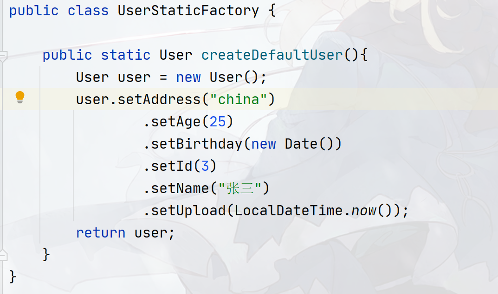

则我们在`bean`标签中需要使用`factory-method`属性来创建`User`对象。我们需要指定`bean`标签的`id`属性，同样`id`唯一，然后`class`属性需要填写工厂类的全限定类名，即`UserStaticFactory`类，最后`factory-method`属性需要指定静态工厂方法，即`createDefaultUser`：

```xml
<bean id="static-factory-method-create-user" class="cn.argento.askia.factory.UserStaticFactory" factory-method="createDefaultUser"></bean>
```

如果希望使用对象工厂方法的话，比如我们有一个对象工厂类：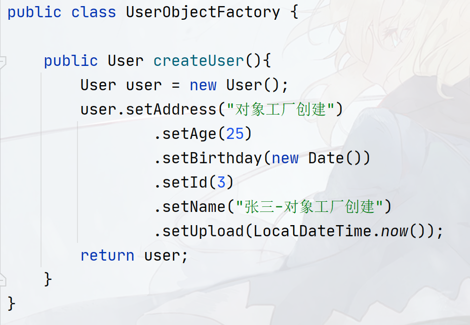

则需要先创建对象工厂类的对象，然后指定`factory-bean`属性和`factory-method`属性。其中`factory-bean`属性指定对象工厂类的对象的`id`，`factory-method`属性指定创建`User`类对象的方法，需要指出，使用对象工厂创建对象，需要写两个`bean`标签，并且创建`User`类对象的`bean`标签无需编写`class`属性：

```xml
<!-- 创建对象工厂对象 -->
<bean id="factory-object" class="cn.argento.askia.factory.UserObjectFactory"></bean>
 
<!-- 通过对象工厂对象和工厂方法创建User类的对象,
	！！！注意：不需要写class属性！！
-->
<bean id="object-factory-method-create-user" 
      factory-bean="factory-object" 
      factory-method="createUser"></bean
```

最后，我们通过创建`IoC`容器来测试容器是否能够按照我们的希望来创建这些对象，我们和第一章的时候一样使用`ClassPathXmlApplicationContext`这种类型的`IoC`容器实现类来初始化，代码参考：

```java
public class XmlContextTest {

    @Test
    public void test(){
        ApplicationContext xmlContext =
                new ClassPathXmlApplicationContext("spring-context.xml");
        // 获取容器内所有的
        final String[] beanDefinitionNames = xmlContext.getBeanDefinitionNames();
        System.out.println("容器内所有对象名：" + Arrays.toString(beanDefinitionNames));
        System.out.println("容器内对象数量：" + xmlContext.getBeanDefinitionCount());
        System.out.println();
        for (int i = 0; i < beanDefinitionNames.length; i++) {
            System.out.println(xmlContext.getBean(beanDefinitionNames[i]));
            System.out.println();
        }

    }
}
```

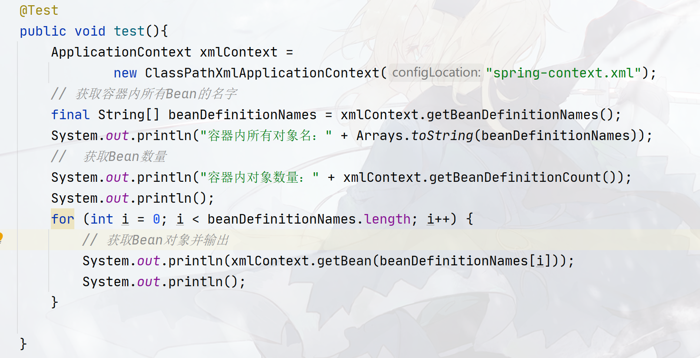

## Java-Config容器配置创建对象

`Spring 3.0`以后，引入了一种很新的配置方式，那就是使用`Java`代码来充当配置文件（我们一般称这样的配置文件叫`Java-config`）。

使用`@Bean`注解标记在方法上，则`spring IoC`在初始化的时候会通过反射`Api`调用一次该方法并将返回值作为`Bean`对象存储在`IoC`容器中。基于`Java-config`的配置，实际上已经不怎么严格区分对象是构造器创建还是静态工厂创建还是对象工厂创建了，基本都是同一套流程，如下面是一个`Java-config`，我们可以看到三种创建方式基本写法模板都是一样的：

```java
public class SpringJavaConfigContext {

    // 基于构造器注入
    @Bean
    public User createUserByConstructor(){
        User user = new User();
        user.setAddress("China");
        user.setAge(40);
        user.setBirthday(new Date());
        user.setId(1);
        user.setName("Askia");
        user.setUpload(LocalDateTime.now());
        return user;
    }

    // 基于静态工厂
    @Bean
    public User createUserByStaticMethod(){
        return UserStaticFactory.createDefaultUser();
    }


    // 基于对象工厂
    @Bean
    public User createUserByObjectMethod(){
        UserObjectFactory factory = new UserObjectFactory();
        return factory.createUser();
    }
}
```

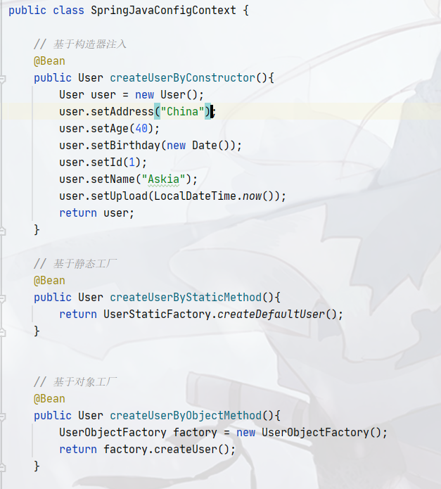

`spring 3`之后针对`Java-config`引入了一类新的`IoC`容器实现类：`AnnotationConfigApplicationContext`，在使用`AnnotationConfigApplicationContext`的时候，可以通过指定`Java-config`的`class`对象的形式来创建`AnnotationConfigApplicationContext`容器：

```java
ApplicationContext annotationContext = new AnnotationConfigApplicationContext(SpringJavaConfigContext.class);
```

其他的代码和`ClassPathXmlApplicationContext`基本一致：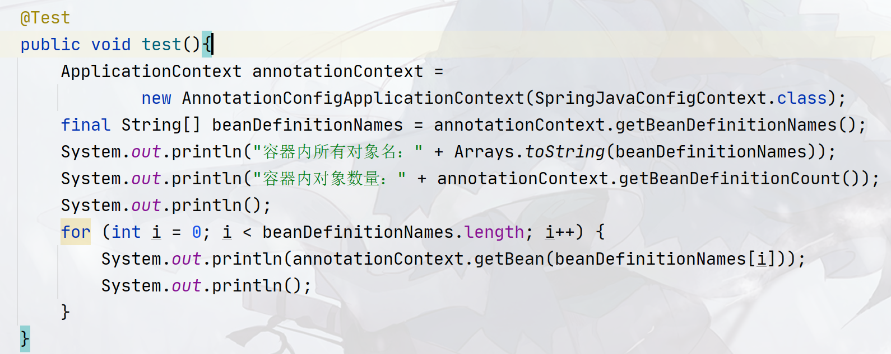

我们将在后面介绍容器的时候介绍常见的`IoC`容器和相关`Api`，这些内容在第`4`章中会进行详细介绍！

## Nested class Instantiation

官方文档参考：[Nested class names](https://docs.spring.io/spring-framework/reference/core/beans/definition.html#beans-factory-class)

开发者有时需要创建内部类的对象，在基于`Java-config`的形式的配置中，你很容易就能实现往容器内存入内部类对象，因为其创建方法就是`Java`创建内部类的方法，比如我们有如下的内部类：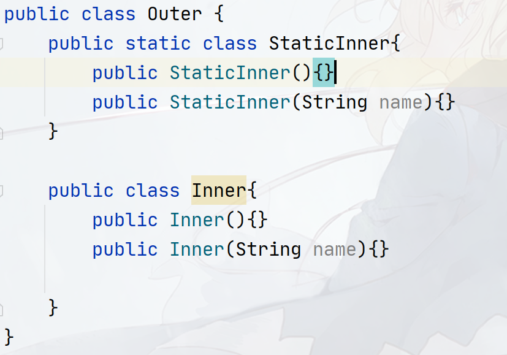

则在`Java-Config`的配置形式下，直接像创建内部类一样`new`出来即可：

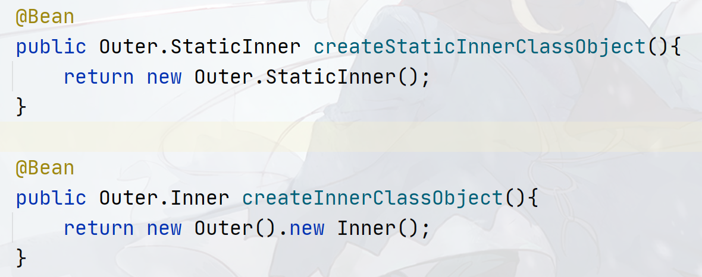

但在`Xml`的配置文件中，可能就会比较麻烦了，官方文档中给出了一个小提示：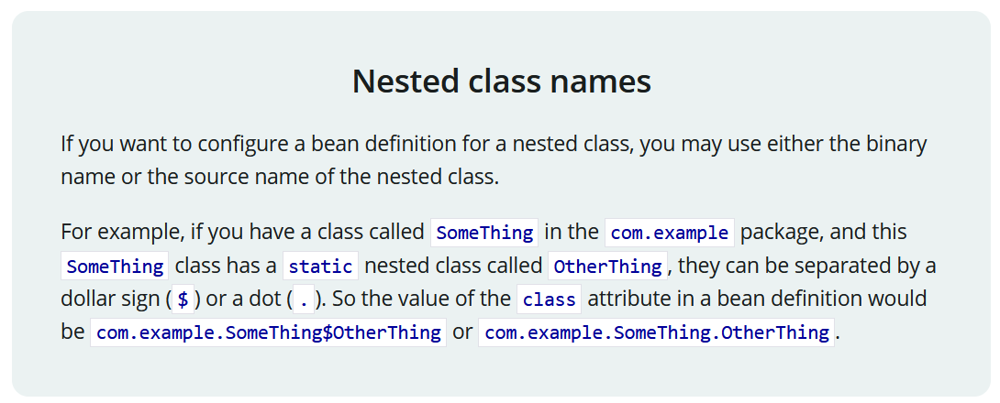

大致意思就是，如果希望创建内部类对象的话，`class`属性你需要使用`$`或者`.`指定具体的内部类名，比如你有一个叫`SomeThing`的类，该类位于`com.example`包中，并且`SomeThing`中有一个`static`的内部类`OtherThing`：

```java
package com.example;

public class SomeThing{
	public static class OtherThing{}
}
```

 则你在填写`class`属性的时候，可以指定下面的类名：`com.example.SomeThing$OtherThing`或者`com.example.SomeThing.OtherThing`。

然而官方文档中到此就结束了，并没有说明具体的`bean`标签的写法和普通内部类的处理，我们回到我们自己定义的内部类中：

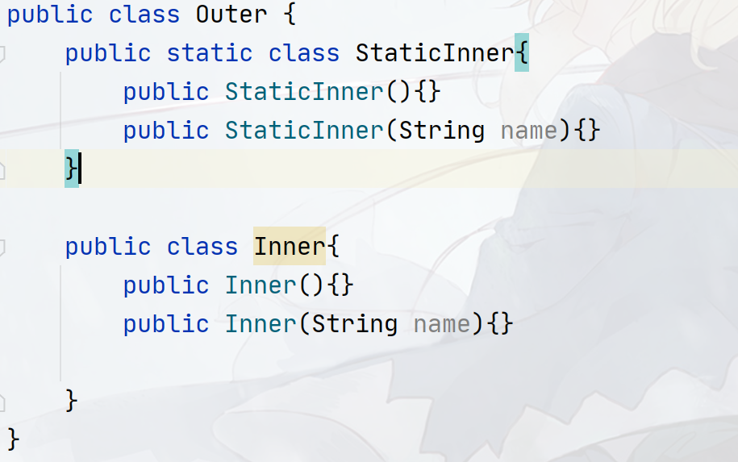

静态内部类我们参考提示说明的那样，使用`bean`标签创建对象：

```xml
<!-- 创建静态内部类对象：
    直接使用outer类.inner类或者outer类$inner类即可
-->
<bean id="static-inner" class="cn.argento.askia.bean.Outer$StaticInner"></bean>
```

然而对于普通内部类，要想使用`xml`容器配置，会有点麻烦，虽然我们的`Inner`类看起来是这样的：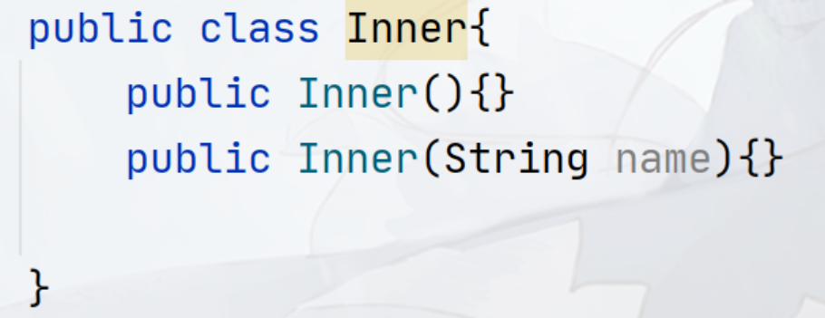

但实际编译完了之后却是这样的：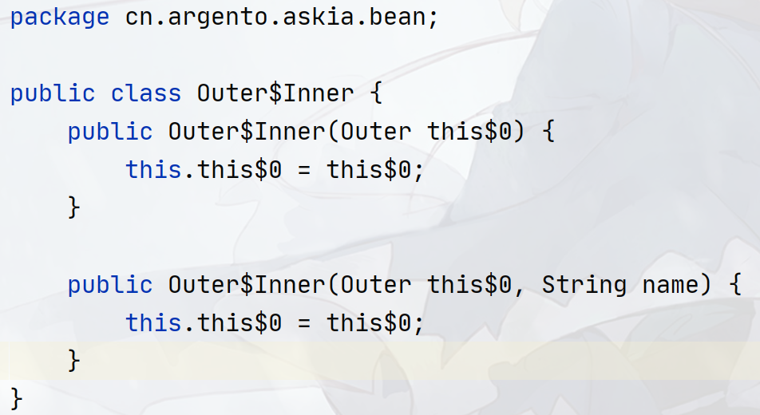

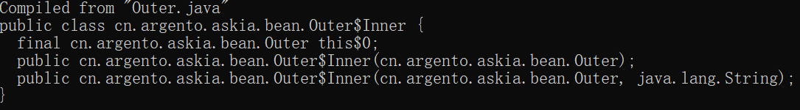

多了一个`Outer`的参数？是的，`Java`就是这样处理内部类的，你之所以在内部类里面能够随意调用外部类的方法和字段（包括`private`），根本原因就在这个`this$0`字段上！换句话说，`Inner()`构造器第`1`个参数永远都是外部类的`this$0`，所以你无法和静态内部类一样，直接指定完`class`属性就完事，除了`class`属性，你还需要指定构造器的第一个参数。在后续依赖注入的章节中，我们会具体介绍如何进行构造器参数注入，这里仅了解即可。

`constructor-arg`标签用来指定构造器参数的类型和要注入的值，其有一个`name`属性和`ref`属性，`name`属性指定构造器参数的参数名，`ref`属性指定要注入的对象的`id`（要注入的对象必须也在`xml`配置中声明，当然我们在后续也会说明不需要声明的方法），`ref`属性一般用于注入引用对象，对于基本类型和字符串类型，使用`value`属性即可。

因此，如果要创建普通内部类，我们还需要先创建外部类的对象，并向`Inner`类的构造器传递外部类的引用，写法参考：

```xml
<!--
    由于内部类对象的创建需要依赖外部类对象，因此一种简单的创建方式就是借助Java的内部类的原理
    Java普通内部类会维护一个带一个参数的构造器，用于保存外部类的实例！
-->
<bean id="outer" class="cn.argento.askia.bean.Outer"></bean>
<bean id="inner" class="cn.argento.askia.bean.Outer.Inner">
    <!--  第一个参数永远都是外部类对象 -->
    <constructor-arg name="this$0" ref="outer"/>
</bean>
```

