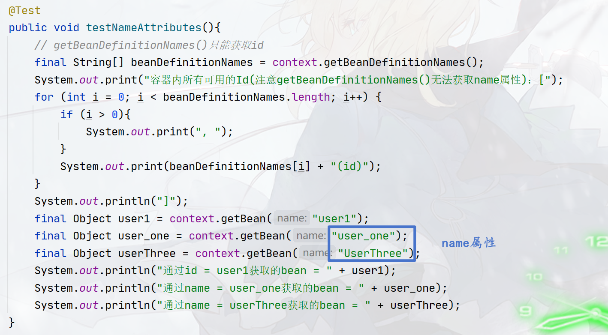
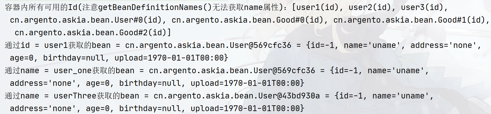

## Bean Name

本小节介绍如何给容器内的`Bean`起别名，即所谓的`Bean Name`，`spring IoC`容器要求`Bean`必须有一个唯一的`id`，但可以有多个`Bean Name`（也可以没有`Bean Name`），因此`Bean id`和`Bean Name`实际上作用是一样的，`IoC`容器对象可以通过`getBean()`，传入`id`或者`Bean name`来获取`Bean`。

总之，`Bean id`和`Bean Name`的区别在于`Bean id`是必须且唯一的，而`Bean name`可以有`0`个或多个！其他功能基本相同。

另外默认情况下如果不指定`Bean id`，`spring`会生成默认`id`，具体的生成方式看配置类型，我们会在后续的内容中介绍。

本小节的文档参考：[spring-beans-bean-name](https://docs.spring.io/spring-framework/reference/core/beans/definition.html#beans-beanname)

### XML配置中的Bean Name

有些时候我们不希望一个`bean`只有一个名称，某些情况下期望能够给`bean`起一个别名，这个时候就需要使用到`Bean`标签的`name`属性。

需要多个名称的时候，可以用`,`或者`;`或者`空格`进行分割：

```xml
<bean id="user1" name="userOne,UserOne,user_one" class="cn.argento.askia.bean.User"></bean>
<bean id="user2" name="userTwo;UserTwo;user_two" class="cn.argento.askia.bean.User"></bean>
<bean id="user3" name="userThree UserThree user_three" class="cn.argento.askia.bean.User"></bean>
```

通过`ApplicationContext`接口的`getBean()` 方法，传入`id`或者`name`即可获取对象。



结果：



### XML中的匿名Bean

`spring`中规定`IoC`内的`Bean`必须拥有一个`id`，然而在`xml`配置中，实际上你可以不指定`id`，如下：

```xml
<bean class="cn.argento.askia.bean.User"/>
```

这种`Bean`一般被称作匿名`Bean`，`spring`默认会使用`全限定类名#X(X是一个数字)`作为匿名`Bean`的`id`，如上面的Bean标签会被赋予`cn.argento.askia.bean.User#0`的`id`。

如果你有多个同类的匿名`Bean`：

```xml
<bean class="cn.argento.askia.bean.Good"/>
<bean class="cn.argento.askia.bean.Good"/>
<bean class="cn.argento.askia.bean.Good"/>
```

则会生成带数字的，数字从`0`开始，以此类推：

```
cn.argento.askia.bean.Good#0
cn.argento.askia.bean.Good#1
cn.argento.askia.bean.Good#2
```

你仍然可以使用`getBean()`来获取这种匿名的`bean`，传递上面的看起来比较奇怪的`id`：

```java
applicationContext.getBean("cn.argento.askia.bean.Good#0");
applicationContext.getBean("cn.argento.askia.bean.Good#1");
```

但是注意，**在进行依赖注入的时候，匿名的bean不能被引用，如果某个bean在进行依赖注入时需要使用这个匿名的Bean，无法使用`ref`属性引用。**

另外如果不指定`id`，但指定了`name`属性，则`name`属性的第一个名称将会被当作`id`，如：

```xml
<bean name="userTwo;UserTwo;user_two" class="cn.argento.askia.bean.User"></bean>
```

则`userTwo`会被当作该`Bean`的`id`。

最后要说明的是，在获取匿名`Bean`的时候，传入的`id`不带`#X`的后缀时，将随机返回其中一个匿名`Bean`，如现在有三个同类型的匿名`Bean`：

```
cn.argento.askia.bean.Good#0
cn.argento.askia.bean.Good#1
cn.argento.askia.bean.Good#2
```

如果传递给`getBean()`的`id`是不带后缀`#X`的：

```java
applicationContext.getBean("cn.argento.askia.bean.Good");
```

则返回的将会是`cn.argento.askia.bean.Good#0`、`cn.argento.askia.bean.Good#1`、`cn.argento.askia.bean.Good#2`中的随机的一个。

### XML配置的Alias别名标签

> 关于`Alias name`的更多内容，请参考[Aliasing a Bean outside the Bean Definition](https://docs.spring.io/spring-framework/reference/core/beans/definition.html#beans-beanname-alias)小节。

可以通过`alias`标签来给`Bean`起别名，这样起别名将不仅限于`name`属性，`id`也可以：

```xml
<alias name="fromName | id" alias="toName"/>
```

另外也可以给匿名`Bean`起别名：

```xml
<alias name="user_one" alias="user"/>
<alias name="cn.argento.askia.bean.Good#0" alias="good"/>
```

```java
final Object good = context.getBean("good");
final Object good0 = context.getBean("cn.argento.askia.bean.Good#0");
final Object user = context.getBean("user");
final Object user1 = context.getBean("user_one");
// good == good0
System.out.println(good);
System.out.println(good0);
// user == user1
System.out.println(user);
System.out.println(user1);
```

### Java-config配置Bean Name

> 关于此小节内容，参考：[customizing bean naming with @Bean](https://docs.spring.io/spring-framework/reference/core/beans/java/bean-annotation.html#beans-java-customizing-bean-naming)和[Bean Aliasing](https://docs.spring.io/spring-framework/reference/core/beans/java/bean-annotation.html#beans-java-bean-aliasing)

`@Bean`注解中有一个`name`属性，用来指定`Bean`的`name`和`id`，需要注意，基于注解形式的配置，`Bean id`和`Bean name`区别已经不明显了，正如`xml`配置中省略了`id`就会使用`name`属性的第一个名称作为`id`一样。

另外注解的`value`属性和`name`属性的作用一致，因此在创建`@Bean`的时候，这两个属性二选一即可！

```java
@Bean({"user_two", "userTwo"})
public User user2(){
    return new User();
}

@Bean(name = {"user_three", "userThree"})
public User user3(){
    return new User();
}
```

如果不指定`@Bean`的`name`属性和`value`属性，则默认使用方法名作为`Bean`对象的`id`：

```java
@Bean
public User user1(){
    return new User();
}
// 方法名：user1将会作为该User对象的id
```


